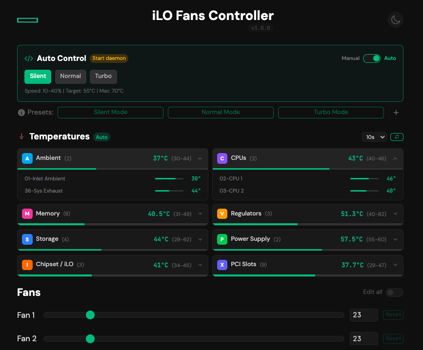

<h1 align="center">iLO Fans Controller</h1>

<p align="center">
  
  <br>
  <i>Easily manage your HP's server fans speeds with automatic temperature-based control!</i>
</p>

---

> 🍴 **This is a fork** of [alex3025/ilo-fans-controller](https://github.com/alex3025/ilo-fans-controller) with significant enhancements for automatic fan control and temperature monitoring.

## ✨ What's New in This Fork

### 🌡️ Temperature Monitoring
- **Real-time temperature display** organized by zones (CPU, Memory, Storage, VR, Chipset, iLO, PCI, Ambient)
- **Auto-refresh** with configurable intervals (5s, 10s, 30s, 60s)
- **Color-coded progress bars** showing temperature relative to critical thresholds
- **Collapsible zone cards** with detailed sensor view

### 🤖 Automatic Fan Control
- **Background daemon** (`fan-daemon.php`) that adjusts fan speeds based on temperatures
- **Three built-in profiles**: Silence, Normal, Turbo
- **Manual/Auto toggle** in the web interface
- **Hysteresis** to prevent fan oscillation (only changes speed if diff > 3%)
- **Ambient temperature safety**: Forces Normal profile if inlet temp > 35°C
- **Persistent configuration** via `auto-control.json`

### 🐳 Enhanced Docker Support
- **Supervisord** manages both Apache and the daemon in a single container
- **Environment variables** for all configuration
- **Health checks** built-in
- **Swarm-ready** docker-compose.yml

### ⚡ Performance Optimizations
- **Combined SSH commands** for faster fan speed application
- **Timeout handling** to prevent blocking
- **Fan count detection** from iLO API

---

## 🚀 Quick Start with Docker

### Docker Run
```bash
docker run -d --name ilo-fans-controller --restart always \
    -p 8080:80 \
    -e ILO_HOST='your-ilo-ip' \
    -e ILO_USERNAME='Administrator' \
    -e ILO_PASSWORD='your-password' \
    -e AUTO_DAEMON='true' \
    harbor.ics.fr/ics/ilo-fans-controller:latest
```

### Docker Compose
```yaml
version: "3.8"

services:
  ilo-fans-controller:
    image: harbor.ics.fr/ics/ilo-fans-controller:latest
    ports:
      - "8080:80"
    environment:
      ILO_HOST: 'your-ilo-ip'
      ILO_USERNAME: 'Administrator'
      ILO_PASSWORD: 'your-password'
      MINIMUM_FAN_SPEED: '10'
      AUTO_DAEMON: 'true'
    volumes:
      - ilo-fans-data:/data
    deploy:
      replicas: 1
      restart_policy:
        condition: on-failure

volumes:
  ilo-fans-data:
```

### Environment Variables

| Variable | Description | Default |
|----------|-------------|---------|
| `ILO_HOST` | IP address of your iLO interface | *required* |
| `ILO_USERNAME` | iLO username | *required* |
| `ILO_PASSWORD` | iLO password | *required* |
| `MINIMUM_FAN_SPEED` | Minimum allowed fan speed (%) | `10` |
| `AUTO_DAEMON` | Enable background auto-control daemon | `true` |

---

## 🎛️ Auto-Control Profiles

The daemon uses profiles to determine fan speeds based on CPU temperatures:

| Profile | Fan Speed Range | Target Temp | Max Temp |
|---------|-----------------|-------------|----------|
| **Silence** | 10% - 40% | 55°C | 70°C |
| **Normal** | 20% - 70% | 50°C | 65°C |
| **Turbo** | 40% - 100% | 40°C | 55°C |

### How It Works

1. The daemon reads CPU temperatures every 20-30 seconds
2. Calculates optimal fan speed using linear interpolation:
   - Below target temp → minimum speed
   - Above max temp → maximum speed
   - Between → proportional speed
3. Applies hysteresis: only changes if new speed differs by > 3%
4. Safety: Forces Normal profile if ambient temp > 35°C

### Configuration File (`auto-control.json`)

```json
{
  "enabled": true,
  "profile": "silence",
  "profiles": {
    "silence": {
      "label": "Silence",
      "minSpeed": 10,
      "maxSpeed": 40,
      "targetTemp": 55,
      "maxTemp": 70
    }
  },
  "checkInterval": 20
}
```

---

## 🔧 Manual Installation

### Requirements
- HP server with **patched iLO 4** firmware (Gen8/Gen9)
- PHP 8.x with `php-curl`, `php-ssh2`, `php-pcntl`, `php-posix`
- Apache or Nginx web server

### Installation Steps

1. Clone the repository:
   ```bash
   git clone https://github.com/jorisbertomeu/ilo-fans-controller.git
   cd ilo-fans-controller
   ```

2. Create your config file:
   ```bash
   cp config.inc.php.example config.inc.php
   nano config.inc.php
   ```

3. Copy files to web server:
   ```bash
   sudo cp ilo-fans-controller.php /var/www/html/index.php
   sudo cp fan-daemon.php auto-control.json config.inc.php favicon.ico /var/www/html/
   ```

4. Start the daemon (optional, for auto-control):
   ```bash
   nohup php /var/www/html/fan-daemon.php > /dev/null 2>&1 &
   ```

---

## 📡 API Reference

### GET Endpoints

| Endpoint | Description |
|----------|-------------|
| `?api=fans` | Get current fan speeds |
| `?api=temperatures` | Get temperature readings (grouped by zone) |
| `?api=presets` | Get saved presets |
| `?api=autocontrol` | Get auto-control configuration |

### POST Actions

| Action | Payload | Description |
|--------|---------|-------------|
| `fans` | `{ "action": "fans", "fans": 50 }` | Set all fans to 50% |
| `presets` | `{ "action": "presets", "presets": [...] }` | Save presets |
| `autocontrol` | `{ "action": "autocontrol", "config": {...} }` | Update auto-control config |

---

## ⚠️ Requirements

This tool requires a **patched iLO firmware** that exposes fan control commands via SSH. 

- ✅ Supported: **Gen8 & Gen9 servers with iLO 4**
- 🚫 Not supported: Gen10/11/12 with iLO 5/6/7

More info: [Reddit post about iLO 4 patching](https://www.reddit.com/r/homelab/comments/sx3ldo/hp_ilo4_v277_unlocked_access_to_fan_controls/)

---

## 🙏 Credits

- Original project by [alex3025](https://github.com/alex3025/ilo-fans-controller)
- Fork maintained by [Jobertomeu](https://github.com/jobertomeu)

---

## 📝 License

This project is open source. See the original repository for license information.
